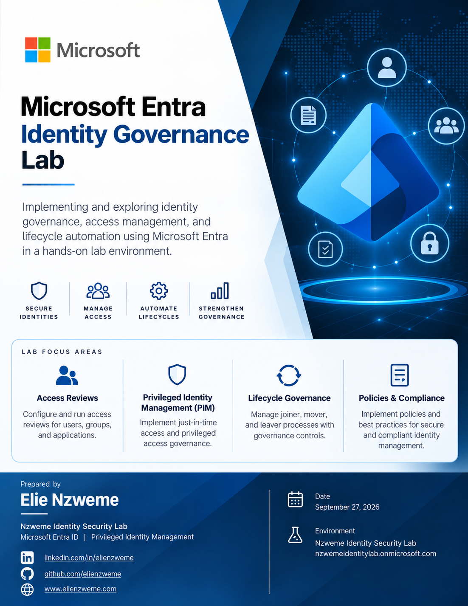

# Microsoft Entra Identity Governance Lab


<p align="center">
  
</p>

---

## Overview

This project demonstrates the implementation of **Microsoft Entra Identity Governance** controls using **Access Reviews** to identify, certify, and remediate privileged group access.

The lab simulates an enterprise access-certification process in which administrative access is periodically reviewed to determine whether users continue to have a legitimate business requirement for privileged access.

Rather than manually removing unnecessary access, the project demonstrates the complete governance lifecycle:

**Access Assignment → Access Review → Recommendation → Human Decision → Remediation → Audit Validation**

### Skills Demonstrated

- Microsoft Entra ID Governance
- Access Reviews
- Identity and Access Management (IAM)
- Privileged access certification
- Security group governance
- Reviewer workflows
- Activity-based recommendations
- Human approval and denial decisions
- Business justification
- Least-privilege enforcement
- Access remediation
- Microsoft Entra audit logging
- Privileged Identity Management concepts

---

## Business Scenario

The fictional **Nzweme Identity Security Lab** uses the security group:

`SG-IAM-Administrators`

to represent privileged Identity and Access Management personnel.

Before the access certification, the group contained two identities:

| Identity | Initial State | Business Context |
|---|---|---|
| **Elie Admin** | Member | Authorized IAM administrator |
| **Test User01** | Member | Simulated stale/inactive privileged access |

The security objective was to determine:

> **Do these identities still have a legitimate business requirement for IAM administrative access?**

An Access Review was therefore created to certify the existing membership.

---

## Governance Architecture

```text
┌───────────────────────────────┐
│    SG-IAM-Administrators      │
│                               │
│  Elie Admin                   │
│  Test User01                  │
└──────────────┬────────────────┘
               │
               ▼
┌───────────────────────────────┐
│ Microsoft Entra ID Governance │
│                               │
│        Access Review          │
└──────────────┬────────────────┘
               │
               ▼
┌───────────────────────────────┐
│ Activity-Based Recommendations│
│                               │
│ Elie Admin   → Approve        │
│ Test User01  → Deny           │
└──────────────┬────────────────┘
               │
               ▼
┌───────────────────────────────┐
│         Human Reviewer        │
│                               │
│          Lab Admin            │
└──────────────┬────────────────┘
               │
        ┌──────┴──────┐
        ▼             ▼
     APPROVE         DENY
        │             │
        ▼             ▼
 Retain Access    Remove Access
        │             │
        └──────┬──────┘
               ▼
┌───────────────────────────────┐
│       Apply Review Results    │
└──────────────┬────────────────┘
               │
               ▼
┌───────────────────────────────┐
│       Audit Verification      │
└───────────────────────────────┘
```

---

# Implementation

## Phase 1 — Privileged Group Preparation

The security group used for the governance exercise was:

```text
SG-IAM-Administrators
```

Initial membership:

```text
SG-IAM-Administrators
│
├── Elie Admin
│
└── Test User01
```

`Elie Admin` represented legitimate administrative access.

`Test User01` represented an account whose access was no longer required.

This provided a realistic scenario for demonstrating access certification and least-privilege remediation.

---

## Phase 2 — Access Review Configuration

A one-time Access Review was created:

```text
AR002-SG-IAM-Administrators-Access-Certification
```

### Configuration

| Setting | Configuration |
|---|---|
| Resource | SG-IAM-Administrators |
| Scope | Everyone |
| Reviewer | Lab Admin |
| Review Type | One time |
| Decision Assistance | Enabled |
| Sign-in Activity Window | 30 days |
| Require Justification | Enabled |
| Email Notifications | Enabled |
| Reminders | Enabled |
| Auto-apply Results | Disabled |
| If Reviewer Does Not Respond | No change |

Automatic remediation was intentionally disabled.

This separated:

**Governance Decision**

from:

**Access Remediation**

allowing both stages to be demonstrated and audited independently.

---

## Phase 3 — Microsoft Entra Recommendations

Microsoft Entra evaluated account activity and generated recommendations for the reviewer.

| Identity | Recommendation | Reason |
|---|---|---|
| **Elie Admin** | Approve | Recent tenant sign-in activity |
| **Test User01** | Deny | Inactive user / no sign-in within configured period |

Recommendations were treated as **decision-support information**, not automatic authorization decisions.

The final determination remained with the designated human reviewer.

---

## Phase 4 — Human Access Certification

The review was performed by:

```text
Lab Admin
```

### Elie Admin

Decision:

```text
APPROVED
```

Business justification:

> Continued access approved. Elie Admin requires SG-IAM-Administrators membership to perform authorized identity and access management administration within the Nzweme Identity Security Lab.

### Test User01

Decision:

```text
DENIED
```

Business justification:

> Access denied. The account is inactive and has no current business requirement for IAM administrative access. Membership should be removed in accordance with least-privilege and access governance principles.

---

## Phase 5 — Access Review Results

The completed certification produced:

| Result | Count |
|---|---:|
| Approved | 1 |
| Denied | 1 |
| Not Reviewed | 0 |
| Don't Know | 0 |

Final decisions:

| Identity | Recommendation | Reviewer Decision |
|---|---|---|
| Elie Admin | Approve | **Approved** |
| Test User01 | Deny | **Denied** |

The review was then completed.

---

## Phase 6 — Least-Privilege Remediation

Because automatic application of review results was disabled, remediation was deliberately initiated after certification.

The completed Access Review results were applied.

Microsoft Entra Identity Governance then processed the denied decision.

### Before Remediation

```text
SG-IAM-Administrators
│
├── Elie Admin
└── Test User01
```

### After Remediation

```text
SG-IAM-Administrators
│
└── Elie Admin
```

`Test User01` was successfully removed from the privileged group through the **Identity Governance remediation workflow**.

The membership was not manually removed by an administrator.

This demonstrates governance-driven least-privilege enforcement.

---

# Audit Validation

Microsoft Entra audit logs were reviewed after the certification and remediation process.

Successful events included:

```text
Create access review
        ↓
Approve decision
        ↓
Deny decision
        ↓
Access review ended
        ↓
Apply decision
        ↓
Apply review
```

The remediation audit event reported:

```text
applyResult: Success
```

The **Apply decision** activity was successfully initiated by `Lab Admin`.

Microsoft Entra **Identity Governance** subsequently processed the review application successfully.

The final membership of `SG-IAM-Administrators` was independently verified and confirmed that `Test User01` had been removed.

---

# Security Controls Demonstrated

## Least Privilege

Administrative access is retained only when a continuing business requirement exists.

The inactive account was removed from the privileged security group after certification.

## Access Certification

Existing access was reassessed rather than being allowed to remain indefinitely.

## Human Oversight

Microsoft Entra recommendations assisted the reviewer but did not replace human authorization decisions.

## Separation of Decision and Remediation

Certification decisions were completed before the results were applied.

This separates:

```text
Should this identity retain access?
```

from:

```text
Apply the resulting access change.
```

## Auditability

The complete governance lifecycle generated audit evidence covering:

- Review creation
- Reviewer decisions
- Review completion
- Decision application
- Remediation processing

## Accountability

Reviewer identity and business justification were captured as part of the certification process.

---

# Governance Workflow

```text
Privileged Access Exists
        │
        ▼
Access Certification
        │
        ▼
Microsoft Entra Recommendation
        │
        ▼
Human Reviewer
        │
   ┌────┴────┐
   │         │
Approve     Deny
   │         │
   ▼         ▼
Retain     Remove
Access     Access
   │         │
   └────┬────┘
        │
        ▼
Apply Review Results
        │
        ▼
Least-Privilege Remediation
        │
        ▼
Audit Verification
```

---

# Technologies

| Technology | Purpose |
|---|---|
| Microsoft Entra ID | Identity platform |
| Microsoft Entra ID Governance | Identity governance |
| Access Reviews | Access certification |
| Entra Security Groups | Privileged access grouping |
| Entra Audit Logs | Governance evidence |
| Microsoft Entra PIM | Privileged access management |
| Microsoft Authentication | Identity verification |

---

# Key Outcomes

This project successfully demonstrated:

- Creation of a privileged-access certification campaign
- Review of existing administrative group membership
- Activity-based access recommendations
- Human access certification
- Documented approval and denial justification
- Removal of unnecessary privileged access
- Least-privilege remediation
- Verification of post-remediation group membership
- Audit validation of the complete workflow

The project demonstrates that privileged access should not simply be **granted and forgotten**.

Access should be:

```text
Granted
   ↓
Reviewed
   ↓
Justified
   ↓
Certified
   ↓
Remediated
   ↓
Audited
```

---

# Project Status

### Identity Governance Phase 1 — Complete ✅

```text
Access Review Configuration     ✅
Reviewer Workflow               ✅
Access Certification            ✅
Approve / Deny Decisions        ✅
Business Justification          ✅
Manual Result Application       ✅
Least-Privilege Remediation     ✅
Group Membership Verification   ✅
Audit Validation                ✅
```

---

# Next Phase — Privileged Access Governance

The next phase extends the architecture into **Privileged Identity Management (PIM)** and enterprise change management.

Planned architecture:

```text
Access Certification
        │
        ▼
PIM Eligible Assignment
        │
        ▼
Jira Change Request
        │
        ▼
PIM Activation Request
        │
        ▼
SG-PIM-Approvers
        │
        ▼
Approval
        │
        ▼
Just-in-Time Privileged Access
        │
        ▼
Conditional Access
        │
        ▼
Phishing-Resistant Authentication
        │
        ▼
Temporary Administrative Access
        │
        ▼
Automatic Expiration
        │
        ▼
Audit Validation
```

This creates an enterprise identity-security model in which:

> **Identity Governance determines whether access should exist.**

> **PIM controls when privileged access becomes active.**

> **Conditional Access controls the conditions under which that access can be used.**

> **Audit logging provides evidence of the entire lifecycle.**

---

## Author

**Elie Nzweme**

Identity & Access Management | Cybersecurity | Cloud Security

GitHub: `elienzweme`  
LinkedIn: `elienzweme`  
Portfolio: `elienzweme.com`

---

## Disclaimer

This project was created in a controlled Microsoft Entra lab environment for educational, cybersecurity, and portfolio demonstration purposes.
